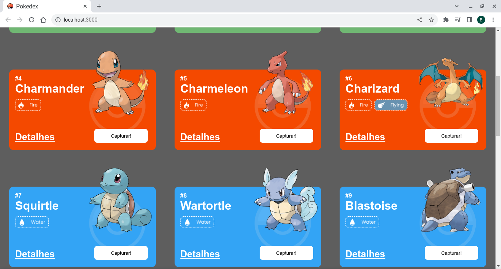
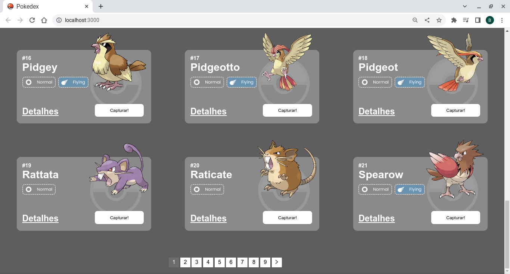
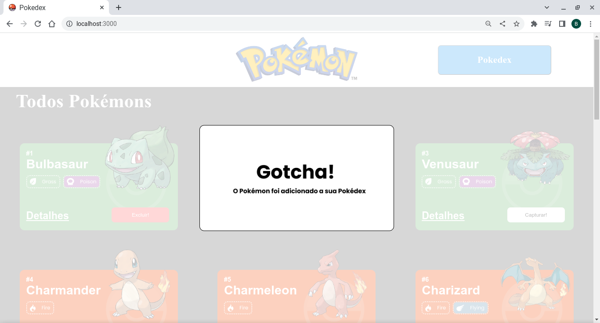
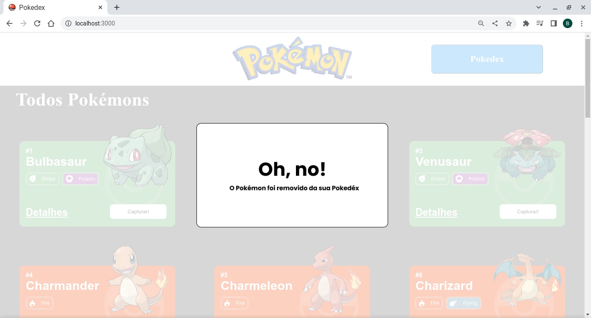
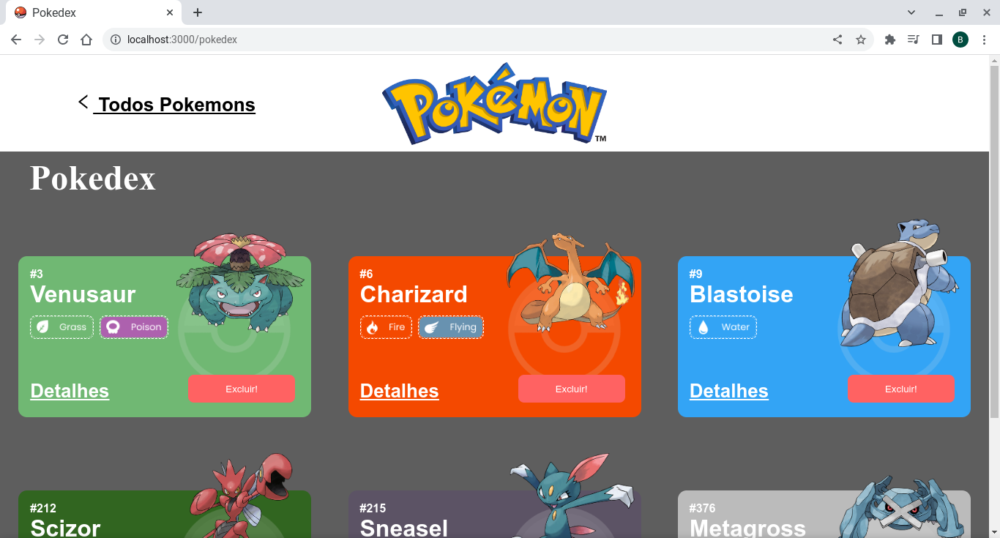
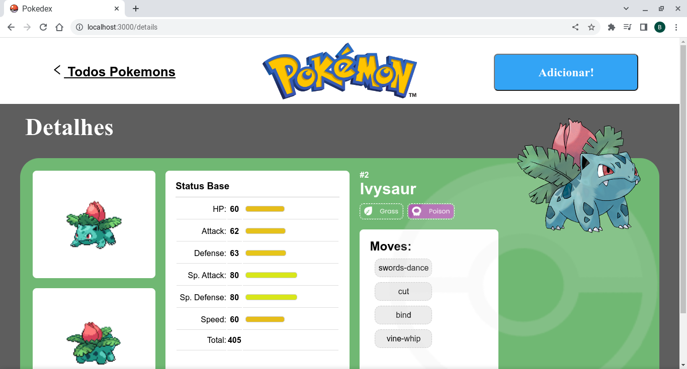
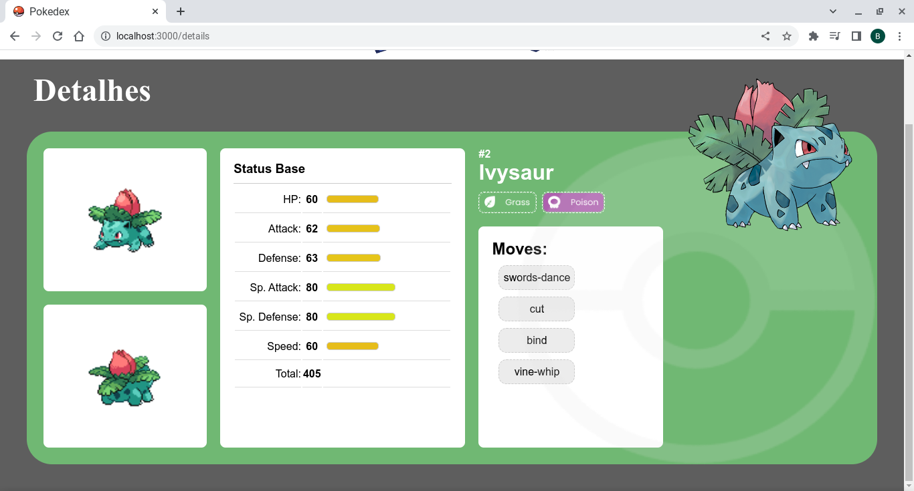

# **Pokédex**

O Projeto pokédex é um site de pokémons que possui três páginas: Home, Pokédex e Detalhes.
O projeto utiliza integração de APIs, react router, estado global e paginação

Este projeto tem como fonte de dados a [Poke Api](https://pokeapi.co/ "Poke Api"), uma Api pública, muito usada para aplicações focadas em aprendizado de programação.

## **Índice**

- <a href="#funcionalidades">Funcionalidades do projeto</a>
- <a href="#layout">Layout</a>
- <a href="#Demonstração">Demonstração</a>
- <a href="#Tecnologias">Tecnologias Utilizadas</a>
- <a href="#Como"> Como Rodar este projeto</a>

## **Funcionalidades do Projeto**

- **Geral:**
  - [x] O site deve ter 3 páginas: Home, Pokedex e Detalhes;
  - [x] Projeto deve seguir o [design](https://www.figma.com/file/KseyA2Ofghiek2Cy3ZaDre/Poked%C3%A9x?t=AEi3zEmWmarf1FbP-0 "design") proposto;
  - [x] O fluxo de trocas de páginas devem ser semelhante ao [fluxograma](https://www.figma.com/proto/KseyA2Ofghiek2Cy3ZaDre/Poked%C3%A9x?page-id=0%3A1&node-id=2%3A2&viewport=358%2C197%2C0.27&scaling=scale-down&starting-point-node-id=2%3A2 "fluxograma");
- **Página Home:**
  - [x] Mostrar uma lista de Pokemons, contendo ao menos 20 Pokemons;
  - [x] Cada Pokemon será representado por um Card;
  - [x] Em cada card de Pokemon tem um botão para adicioná-lo à Pokedex e um outro botão para acessar os detalhes do Pokemon;
  - [x] Header dessa página terá um botão para acessar a página da Pokedex
  - [x] Há uma função de paginação
- **Página Pokédex**
  - [x] Renderizar a lista de pokémons adicionados na pokedex;
  - [x] Em cada card de Pokemon deve ter um botão para removê-lo da Pokedex e um outro botão para acessar os detalhes do Pokemon.
  - [x] Header deve ter um botão para voltar para a Home
  - [x] Não deve ser possível adicionar o mesmo Pokemon duas vezes na Pokedex
- **Página de Detalhes**
  - [x] Mostrar os detalhes do Pokemon selecionado, com informações descritas
  - [x] Header deve ter um botão para adicionar ou remover da Pokedex e outro para voltar a página home.

## **Layout**

- **Home Page**
  
  
- **Adicionar na Pokédex**
  
- **Remover da Pokédex**
  
- **Pokédex**
  
- **Detalhes Page**
  
  

### **Demonstração**

[Link demostração](https://repulsive-knife.surge.sh/)

### **Tecnologias Utilizadas**

- [React.js](https://pt-br.reactjs.org/)
- [React Router](https://reactrouter.com/en/main/start/overview)
- [Styled-components](https://styled-components.com/)
- [React Context](https://reactjs.org/docs/context.html)
- [Hooks](https://reactjs.org/docs/hooks-intro.html)
- [Axios](https://axios-http.com/ptbr/docs/intro)
- [React Icons](https://react-icons.github.io/react-icons)

### **Como Rodar este projeto**

```bash
# Clone este repositório
$ git clone https://github.com/hammes22/Pokedex.git

# Acesse a pasta do seu projeto no seu terminal
cd Pokedex

# Instale as dependências
$ npm install

# Execute a aplicação
$ npm run start

# A aplicação sera iniciada na porta 3000, acesse pelo navegador: http://localhost:3000
```

### **Autor**

Bruno Hammes da Cruz

[Linkedin](https://www.linkedin.com/in/bruno-hammes-80ba9214b/)

[GitHub](https://github.com/hammes22)
